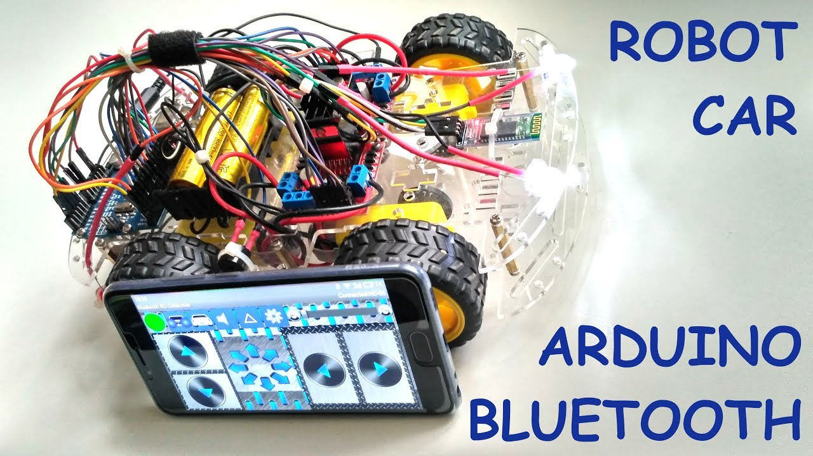

# Car with Arduino UNO
This repository that holds the codes, libraries and guides on how to build up a bluetooth controlled car. 
Later this project may extented by the author [Laxr24](https://github.com/Laxr24) for further development and experiment with new technologies.

## Components used:
    1. Arduino UNO x1
    2. HC-05 x1 ( Bluetooth Module )
    3. Car Module x1
    4. External wiring (as per need)
    5. Android App to control the car

## API References
1. Motor driver board ---->  [L293D](https://lastminuteengineers.com/l293d-motor-driver-shield-arduino-tutorial/)

2. HC-05 Operation  -----> [HC-05](https://lastminuteengineers.com/hc05-bluetooth-arduino-tutorial/)

### Diagram and image

    
<p style="text-align:center; display:block;"> Figure 1.1: Car Circuit setup</p> 
    


<p style="text-align:center; display:block;"> Figure 1.2: Arduino Car</p>

```html
    <h1> Hello world</h1>
    <script>
        console.log("Hello world")
    </script>
```

